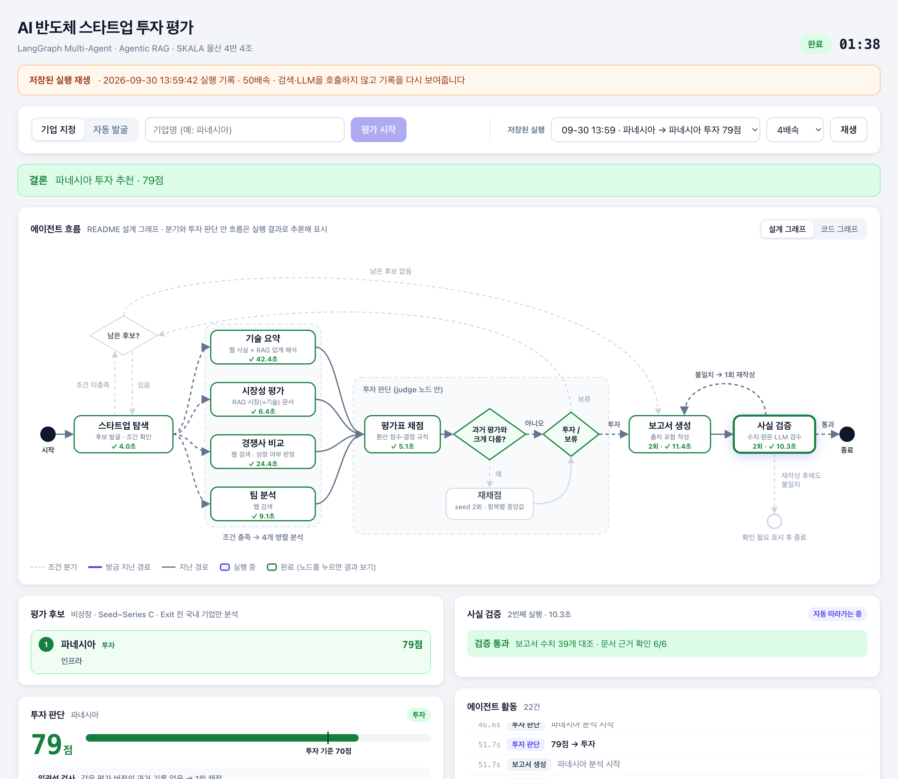

# AI 반도체 스타트업 투자 평가 — 에이전트 시연 웹

LangGraph 멀티 에이전트가 국내 AI 반도체 스타트업을 발굴·분석해 투자 여부를 판단하는 과정을 웹에서 실행하고, 에이전트가 도는 모습을 실시간으로 보여주는 앱입니다.

- 에이전트 본체는 조별 과제 저장소 [97-99-02/ai-startup-investment-agent](https://github.com/97-99-02/ai-startup-investment-agent)입니다. 이 저장소는 그 코드를 수정하지 않고 git submodule(`agent/`)로 가져와 FastAPI + Vue 화면을 붙였습니다.
- 로컬 실행용입니다. 서버는 `127.0.0.1`에만 열리고 인증이 없습니다.



## 빠른 시작

필요한 것: git, [uv](https://docs.astral.sh/uv/getting-started/installation/), [Node.js](https://nodejs.org) 20.19 이상. macOS·Linux 기준이며 Windows는 WSL에서 실행합니다.

```bash
git clone --recurse-submodules https://github.com/97-99-02/web.git
cd web
./demo.sh
```

브라우저에서 http://127.0.0.1:8000 을 엽니다.

- **실시간 평가**는 웹 검색(Tavily)과 LLM(OpenAI)을 호출하므로 키가 필요합니다. `agent/.env`에 키를 넣고 `./demo.sh`를 다시 실행합니다.
- **키가 없으면** 실시간 평가는 막히고, **저장된 실행 → 재생**만 할 수 있습니다. 재생은 키를 넣고 실제로 돌렸던 실행의 기록(검색 출처·분석 결과·점수·보고서)을 그대로 다시 보여줄 뿐, 검색이나 LLM을 새로 호출하지 않습니다. 저장소에 이런 기록 2건이 들어 있습니다.

| 변수 | 용도 |
|---|---|
| `OPENAI_API_KEY` | 분석·판단·보고서 LLM (gpt-4.1-mini, gpt-4.1) |
| `TAVILY_API_KEY` | 웹 검색 |
| `HF_TOKEN` (선택) | 임베딩 모델(KURE-v1) 내려받기 |

처음 실행할 때 `demo.sh`가 하는 일은 다음과 같습니다. 이미 된 단계는 건너뜁니다.

1. 에이전트 코드(submodule)를 받습니다. `--recurse-submodules`로 클론했으면 건너뜁니다.
2. `agent/.env`가 없으면 빈 템플릿을 만듭니다.
3. uv로 Python 3.11 환경을 만들고(torch 포함), 임베딩 모델을 내려받아 문서 10편을 벡터DB에 적재합니다.
4. 화면을 빌드하고 서버를 띄웁니다.

## 화면

| 영역 | 내용 |
|---|---|
| 실행 | **기업 지정**(입력한 한 곳만 평가) / **자동 발굴**(고정 검색어로 후보를 찾아 최대 5곳 차례로 평가) |
| 에이전트 흐름 | **설계 그래프**(에이전트 README 그림: 남은 후보 분기, 투자 판단 안의 일관성 검사·재채점, 두 가지 종료)와 **코드 그래프**(`build_graph()`의 실제 노드·연결선) 전환. 노드별 진행 상태·소요 시간, 지난 경로 강조 |
| 평가 후보 | 후보별 조건 확인·분석·보류·투자 상태와 환산 점수 |
| 투자 판단 | 항목별 점수(1~5)·비중·환산 점수, 투자 기준선, 보류 사유, 일관성 검사(재채점) 결과, 핵심 항목 주의, 법률·주요 리스크 |
| 에이전트 결과 | 노드를 누르면 그 에이전트의 결과와 근거 출처 (기업 정보, 기술 요약·업계 해석, 시장 수치, 경쟁사 표, 팀, 사실 검증) |
| 투자 보고서 | 보고서 본문, 사실 검증 결과, PDF 다운로드 |
| 저장된 실행 재생 | 끝까지 돈 실행은 자동 저장되고, 검색·LLM 호출 없이 같은 화면으로 다시 재생 (재생 중임을 화면 위에 표시) |

**데모 링크:** 주소 뒤에 `?replay=<기록 ID>&speed=4`를 붙여 열면 그 기록을 바로 재생합니다.
예: http://127.0.0.1:8000/?replay=20260930-135942-aaa8&speed=4

## 동작 방식

1. `POST /api/runs`로 실행을 만들면 백엔드가 스레드에서 `build_graph().stream(..., stream_mode=["tasks", "values"])`를 돌립니다.
2. `tasks` 스트림의 시작·종료를 `node_start` / `node_end` 이벤트로 바꿔 쌓고, 화면은 SSE(`GET /api/runs/{id}/events`)로 받습니다. 연결이 끊겼다 다시 붙으면 `Last-Event-ID` 다음부터 이어 받습니다.
3. 기업 지정은 `candidates=[기업명]`을 넣어 시작합니다. 탐색 노드가 `state.get("candidates") or discover_candidates()`로 되어 있어 발굴 단계만 건너뜁니다.
4. 설계 그래프의 분기(남은 후보? / 과거 평가와 다름? / 투자·보류 / 두 종료)는 실제 LangGraph 노드가 아니라 분기 함수와 judge 노드 안의 로직이라, 노드 결과로 경로를 추론합니다(`frontend/src/useRun.js`의 `designEvent`). 재채점 여부는 state에 없어서, judge가 끝날 때 채점 로그(`agent/outputs/judge_log.jsonl`)에서 이번 실행의 기록을 읽습니다.
5. 실행이 끝나면 마지막 state로 PDF를 만들고, 이벤트 전체와 실행 당시 평가 설정(비중·기준)을 `backend/recordings/`에 저장합니다.
6. 병렬 분석 노드가 Chroma를 함께 쓰므로 실행은 한 번에 한 건만 받습니다. 두 번째 요청은 409를 돌려주고, 화면은 진행 중인 실행에 붙습니다.
7. 키가 없으면 서버는 키 유무만 알려주고(값은 보내지 않음) 실시간 평가 요청을 거절합니다.

## 구조

```
web/
├── agent/                 # submodule → 97-99-02/ai-startup-investment-agent
├── backend/
│   ├── server/
│   │   ├── agent.py       # 에이전트 저장소 import (작업 폴더 이동, .env 로드, 임베딩 미리 로딩, 키 유무)
│   │   ├── runner.py      # 그래프 실행(스레드) → 이벤트, 한 번에 한 건, 실행 기록 저장·재생
│   │   └── main.py        # FastAPI 라우트, SSE, frontend/dist 정적 제공
│   ├── recordings/        # 실행 기록(.jsonl)과 보고서 PDF
│   ├── requirements.txt   # fastapi, uvicorn (에이전트 의존성 위에 얹음)
│   └── run.sh             # 에이전트의 uv 환경(uv.lock)에 FastAPI만 얹어 실행
├── frontend/              # Vite + Vue 3
│   └── src/
│       ├── useRun.js      # SSE 이벤트 → 화면 상태, 설계 그래프 경로 추론
│       ├── constants.js   # 노드 이름, 그래프 좌표, 항목 이름
│       └── components/    # DesignGraph, PipelineGraph, CandidateTrack, ScoreBoard, NodeDetail, ActivityLog, ReportView …
└── demo.sh                # 준비 + 화면 빌드 + 서버 실행
```

## 개발 모드

화면을 고치면서 볼 때는 서버와 화면을 따로 띄웁니다.

```bash
backend/run.sh                 # API  http://127.0.0.1:8000
cd frontend && npm run dev     # 화면 http://localhost:5174 (/api 는 8000으로 전달)
```

에이전트 저장소를 다른 위치에 이미 받아 두었다면 `backend/.env`에 `AGENT_DIR`로 그 경로를 지정합니다(`backend/.env.example` 참고).

## 네트워크 없이 보기

한 번 인터넷이 되는 곳에서 `./demo.sh`를 실행해 두면, 그 뒤로는 `OFFLINE=1 ./demo.sh`로 uv·Hugging Face 캐시만 써서 띄울 수 있습니다. 이때는 저장된 실행 재생만 됩니다(실시간 평가는 OpenAI·Tavily 호출이 필요). 포트를 바꾸려면 `PORT=8010 ./demo.sh`처럼 실행합니다.

## API

| 메서드 | 경로 | 설명 |
|---|---|---|
| GET | `/api/meta` | 그래프 구조, 평가 설정(비중·기준 점수), 키 유무, 모델 로딩 상태, 진행 중인 실행 |
| POST | `/api/runs` | `{"mode": "company", "company": "파네시아"}` 또는 `{"mode": "discover"}` |
| GET | `/api/runs/{id}/events` | 실행 이벤트 (SSE) |
| POST | `/api/runs/{id}/cancel` | 중단 요청 (진행 중인 노드가 끝난 뒤 멈춤) |
| GET | `/api/recordings` | 저장된 실행 목록 |
| GET | `/api/recordings/{id}/events?speed=4` | 저장된 실행 재생 (SSE) |
| GET | `/api/recordings/{id}/pdf` | 보고서 PDF |

## 알려진 한계

- 중단은 노드 단위입니다. 이미 시작된 노드(LLM·검색 호출)는 끝까지 돈 뒤 멈춥니다.
- 평가 결과는 실행마다 달라질 수 있습니다(웹 검색 결과 변화, LLM 채점). 화면은 에이전트가 낸 값을 그대로 보여주고 보정하지 않습니다.
- 사실 검증의 "확인 필요" 표시에는 오탐이 섞일 수 있습니다. 예를 들어 웹 기사에서 온 기업 사실을 연구 보고서 원문과 대조하거나, "3,400백만달러"와 "34억 달러"를 다른 값으로 읽는 경우입니다. 판정은 에이전트 저장소의 `agents/verifier.py`를 따릅니다.
- 실시간 평가는 실행마다 OpenAI·Tavily를 여러 번 호출합니다. 공개 서버로 띄우려면 인증과 호출 제한을 따로 붙여야 합니다.

## 만든 사람

SKALA 울산캠퍼스 4반 4조. 에이전트별 담당은 [에이전트 저장소의 Contributors](https://github.com/97-99-02/ai-startup-investment-agent#contributors)를 참고하세요. 이 저장소(시연 웹)는 이채목이 만들었습니다.
